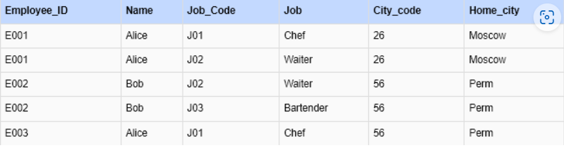

# ht3

Первая нормальная форма (1НФ):

Таблица находится в первой нормальной форме, так как все ее значения являются атомарными и каждая ячейка содержит только одно значение.
Вторая нормальная форма (2НФ):

Таблица находится во второй нормальной форме, если она находится в первой нормальной форме и каждый неключевой атрибут (Job, city_code, Home_city) функционально зависит от ее составного ключа (Employee_ID, Job_code).
В данной таблице неключевые атрибуты (Job, city_code, Home_city) зависят только от составного ключа (Employee_ID, Job_code), а не от части составного ключа. Следовательно, таблица уже находится во второй нормальной форме.
Таблица сотрудников (Employees):

Третья нормальная форма (3НФ):

Таблица находится в третьей нормальной форме, если она находится во второй нормальной форме и каждый неключевой атрибут (Job, city_code, Home_city) не зависит от других неключевых атрибутов.
В данной таблице атрибуты (Job, city_code, Home_city) не зависят от других неключевых атрибутов и функционально зависят только от ее составного ключа (Employee_ID, Job_code). Следовательно, таблица уже находится в третьей нормальной форме.

## Нормализованные таблицы

### Таблица сотрудников (Employees)

| Employee_ID | Name  | city_code |
|-------------|-------|-----------|
| E001        | Alice | 26        |
| E002        | Bob   | 56        |
| E003        | Alice | 56        |

### Таблица должностей (Employee_Jobs)

| Employee_ID | Job_code | Job       |
|-------------|----------|-----------|
| E001        | J01      | chief     |
| E001        | J02      | waiter    |
| E002        | J02      | waiter    |
| E002        | J03      | Bartender |
| E003        | J01      | chief     |

### Таблица городов (Cities)

| city_code | Home_city |
|-----------|-----------|
| 26        | Moscow    |
| 56        | Perm      |
